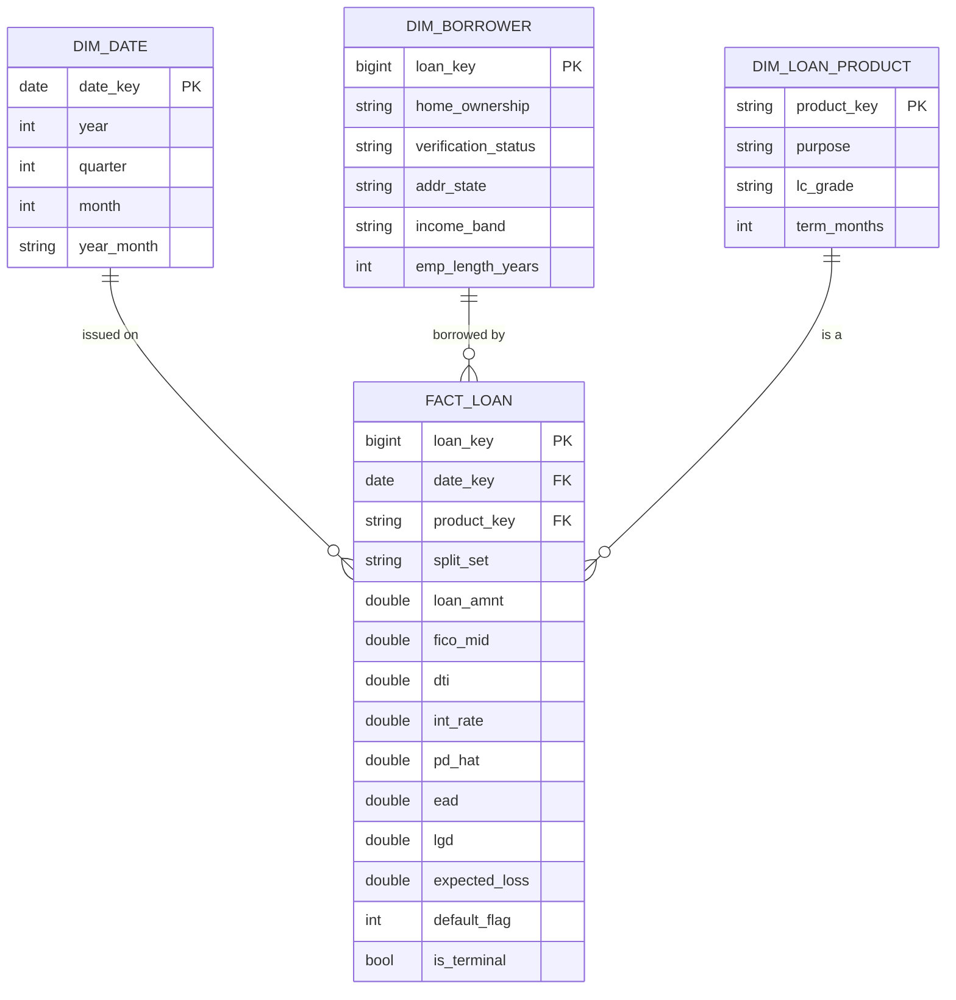

# Star schema — ER diagram

Dimensional model built by `schema/star_schema.sql` as DuckDB **views** over the clean
marts (no data is copied). Grain of `FACT_LOAN`: one row per loan.

## Source lineage

| Star object | Built from |
|---|---|
| `DIM_DATE` | distinct `issue_d` in `mart_loan_features` |
| `DIM_BORROWER` | `mart_loan_features` (one row per loan — Lending Club has no customer id) |
| `DIM_LOAN_PRODUCT` | `mart_loan_features.purpose` × `mart_loan_benchmark.lc_grade` |
| `FACT_LOAN` | `mart_loan_features` + `mart_loan_benchmark` + `mart_scores` + `mart_loan_el` + `mart_loan_outcomes` |

> Note: because Lending Club data has no borrower identifier, `DIM_BORROWER` is 1:1 with
> `FACT_LOAN`. In a real lender this dimension would be keyed on `customer_id` and a
> borrower could appear on many loans.
